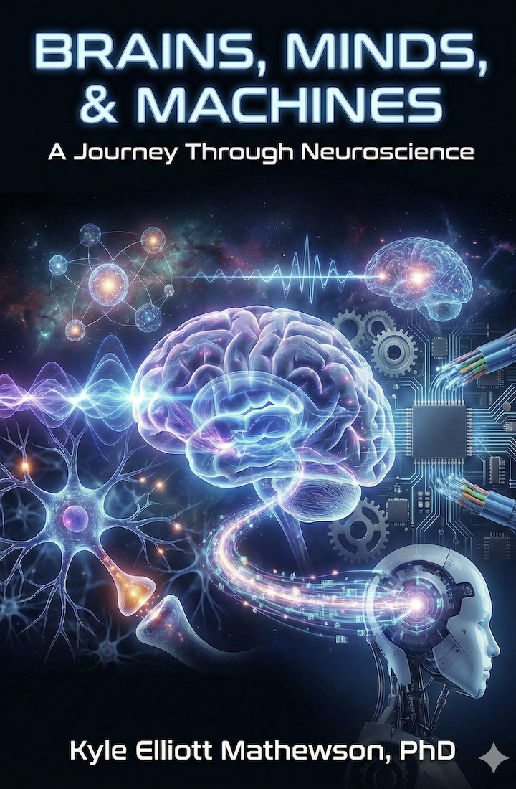

# BrainsMindsMachinesTextbook

A standalone textbook for Intro Neuroscience

## Getting Started

### Prerequisites

List any prerequisites here.

### Installation

```bash
# Add installation instructions
```

### Usage

```bash
# Add usage examples
```

## License

Add license information here.

## Contributing

Contributions are welcome! Please feel free to submit a Pull Request.

## Preview

<p align="center">
  
</p>

